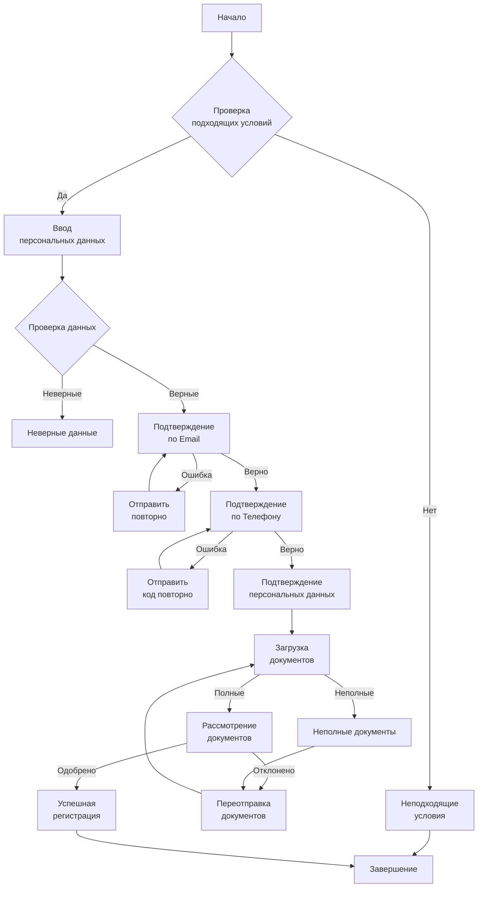

# BRD

## Описание бизнес-процессов

На схеме представлено взаимодействие клиента с системой (юридическое лицо):

- Регистрация клиента

```mermaid
graph TD
    Start[Начало] --> CheckEligibility{Проверка<br>подходящих условий}
    CheckEligibility -- Нет --> NotEligible[Неподходящие<br>условия]
    CheckEligibility -- Да --> EnterDetails[Ввод<br>персональных данных]
    EnterDetails --> ValidateDetails{Проверка данных}
    ValidateDetails -- Неверные --> InvalidDetails[Неверные данные]
    ValidateDetails -- Верные --> VerifyEmail[Подтверждение<br>по Email]
    VerifyEmail -- Ошибка --> ResendEmail[Отправить<br>повторно]
    VerifyEmail -- Верно --> VerifyPhone[Подтверждение<br>по Телефону]
    VerifyPhone -- Ошибка --> ResendCode[Отправить<br>код повторно]
    VerifyPhone -- Верно --> ConfirmDetails[Подтверждение<br>персональных данных]
    ConfirmDetails --> UploadDocuments[Загрузка<br>документов]
    UploadDocuments -- Неполные --> IncompleteDocuments[Неполные документы]
    UploadDocuments -- Полные --> Review[Рассмотрение<br>документов]
    Review -- Отклонено --> Reupload[Переотправка<br>документов]
    Review -- Одобрено --> CompleteRegistration[Успешная<br>регистрация]
    IncompleteDocuments --> Reupload
    Reupload --> UploadDocuments
    ResendEmail --> VerifyEmail
    ResendCode --> VerifyPhone
    NotEligible --> End[Завершение]
    CompleteRegistration --> End
```
